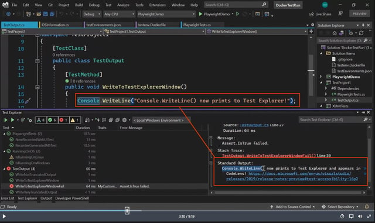

# Visual Studio 2022 - Uso en mi Trabajo Diario

### Tech Stack:  
**Lenguaje**: `C#`, `Gherkin` | **Herramientas**: `Visual Studio 2022`, `SpecFlow`, `Playwright` | **Frameworks**: `.NET`, `SpecFlow`, `xUnit/NUnit` | **CI/CD**: `Azure DevOps` | **Control de versiones**: `Git`

## Experiencia
### Descripción general:

1. Automatización de TCs para evitar demasiada regresión manual. 
- Uso de: 
    - `Visual Studio 2022` - `SpecFlow` - `BDD` usando `Gherkin`, con `Cucumber`, para `.NET`.
2. Creación de BDDs, el archivo `.feature`.
    - Copiando los bindings solamente, aveces haciendo Step definitions en `C#` para los BDDs.
3. Revisión de BDDs
4. Creación de pruebas para smoke Testing, con `Palywright` de `.NET` para los BDDs.

### Herramientas clave utilizadas:

- `SpecFlow` (equivalente a `Cucumber` en el ecosistema de .NET)
- `Gherkin` (lenguaje de especificación para describir el comportamiento)
- `Visual Studio 2022` (IDE para gestionar y ejecutar pruebas automatizadas)
- `C#` (lenguaje utilizado para la implementación de Step Definitions)
- `Playwright` (herramienta para automatizar pruebas de UI y smoke testing)

### Detalle de Día a Día

1.  **Automatización de casos de prueba (TCs)**:
    - Utilizo `Visual Studio 2022` junto con `SpecFlow` (una implementación de `Cucumber` para `.NET`) para automatizar pruebas de aceptación y evitar regresión manual.
    - Escribo los escenarios de prueba en `Gherkin` y los vinculo a código mediante `Step Definitions` en `C#`.

2.  **Creación y revisión de BDDs**:
    - Trabajo con `BDD (Behavior-Driven Development)` utilizando `SpecFlow`, lo que me permite escribir los escenarios de prueba en formato `Gherkin` y ejecutarlos automáticamente dentro de `Visual Studio 2022`.
    - Usando solo el biding:
      ```csharp
      [Given(@"The user imports model (.*)")]
      ```

3.  **Creación de Step Definitions para BDDs**:

    - En `SpecFlow`, defino los `Step Definitions` en `C#` para cada paso de los escenarios escritos en `Gherkin`.
    - Estos pasos se ejecutan al correr las pruebas, automatizando la validación de comportamientos.
    - Ejemplo de `Step Definition` en `C#` para un paso de `Gherkin`:
    ```csharp
        [Given(@"The user imports model (.*)")]
        public void ImportModel(string modelName)
        {
            // STEP code     
        }
        
        [When(@"I create the model (.*)")]
        public void CreateModel(string modelName)
        {
            // STEP code
        }
        
        [Then(@"The model (.*) should be saved successfully")]
        public void SaveModel(string modelName)
        {
            // STEP code
        }
    ```
4. **Automatización de UI y Smoke Testing**:
    - Uso `Playwright` para realizar pruebas de interfaz de usuario (UI) y `smoke testing`.
    - Esto asegura que las funcionalidades básicas del sistema estén operativas  y que las pruebas se realicen de forma rápida y eficiente; import, create, run optimizer, etc
    - Para todos los producted de Aspen Unified
    - Haciendo operaciones asincrónicas usando `async` y `await`, lo que asegura una ejecución no bloqueante de las pruebas.
        - Las acciones como navegar entre páginas, interactuar con elementos de la interfaz o tomar capturas de pantalla se manejan de forma eficiente sin bloquear la ejecución de otras tareas.

5. **Depuración y Pruebas**:
    - Usé las herramientas de `Debug` avanzadas de `Visual Studio 2022` para identificar y resolver errores en las pruebas automatizadas.
    - La integración con el `Test Explorer` permitió ejecutar las pruebas de manera eficiente, ver resultados y hacer seguimiento de la cobertura de pruebas.
    - Además, utilicé `Visual Studio 2022` para gestionar las configuraciones de `Test Run` y asegurar que las pruebas se ejecutaran en el entorno adecuado (local o en la nube).

6. **Integración con Azure DevOps**:
    - `Visual Studio 2022` se integró con `Azure DevOps` para la gestión del repositorio y mapeo al visual studio
    - Utilicé `Azure DevOps` para configurar los pipelines que ejecutaban las pruebas automatizadas de manera continua, lo que aseguraba que cada commit y despliegue fuera validado automáticamente.

Forma de Visual Studio 2022, que usaba:



Aquí se puede ver una captura de pantalla del entorno de `Visual Studio 2022` con las siguientes áreas destacadas: `Test Explorer -> IZQ abajo`, `Solution Explorer`, `Team Explorer`.

---
 
### Conceptos Claves:
- `_SpecFlow_`: Implementación de `_Cucumber_` para `.NET`, utilizado para pruebas de aceptación en `BDD`.
- `_Gherkin_`: Lenguaje usado para escribir los escenarios de prueba en formato legible y estructurado, comúnmente asociado con `_SpecFlow_`.

- `_BDD (Behavior-Driven Development)_`: Enfoque de desarrollo centrado en la colaboración entre desarrolladores, testers y partes interesadas, basado en la descripción de comportamientos.
- `_C#_`: Lenguaje de programación utilizado para escribir las `_Step Definitions_` en `_SpecFlow_` y vincular los escenarios definidos en `_Gherkin_` con el código de prueba.
- `_Step Definitions_`: Es un método con una expresión que lo vincula a uno o más pasos de Gherkin. Cuando Cucumber ejecuta un paso de Gherkin en un escenario, buscará una definición de paso coincidente para ejecutar.
- `_Playwright_`: Herramienta de automatización de pruebas de interfaz de usuario (UI) que permite ejecutar pruebas de aplicaciones web en varios navegadores.


### Conceptos Claves de Visual Studio 2022:
- `_Visual Studio 2022_`: IDE utilizado para desarrollar y ejecutar las pruebas automatizadas, con soporte para la integración de `_SpecFlow_` y `_Azure DevOps_`.
- `_Azure DevOps_`: Herramienta de integración y entrega continua (CI/CD) utilizada para gestionar proyectos, repositorios de código y ejecutar pipelines de pruebas.
- `_Test Explorer_`: Herramienta dentro para gestionar y ejecutar las pruebas automatizadas.
- `_Solution Explorer_`: Panel para navegar por la estructura de carpetas y archivos del proyecto.
- `_Team Explorer_`: Integración para gestionar el código fuente y las tareas de `_Azure DevOps_`.
- `_Build_`: Compila el código fuente de un proyecto o solución, creando los archivos ejecutables o bibliotecas necesarias. Si hay errores de compilación, no se generará el producto final.
- `_Rebuild_`: Similar a "Build", pero primero limpia (elimina) todos los archivos compilados previos y luego recompila todo el proyecto o solución desde cero.
- `_Solution_`: Un contenedor que agrupa uno o más proyectos en Visual Studio. Una solución facilita la organización de proyectos interdependientes y la gestión de su configuración.
- `_NuGet Packages_`: Son bibliotecas de terceros que puedes agregar a tu proyecto, de `.Net`.


### Recursos

- Buscar en Microsoft.com google ahí viene todo los Visual studio 
    - Ejemplo de como Unit Test:
        - https://learn.microsoft.com/en-us/visualstudio/test/run-unit-tests-with-test-explorer?view=vs-2022


### Otras Herramientas
- SQL: SSMS, SQL server management system 20, de windows